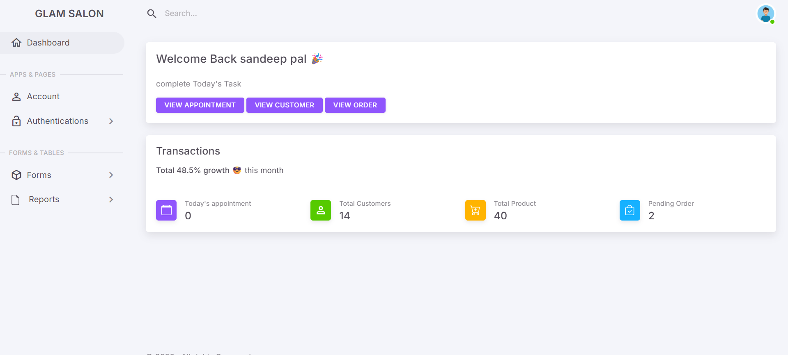
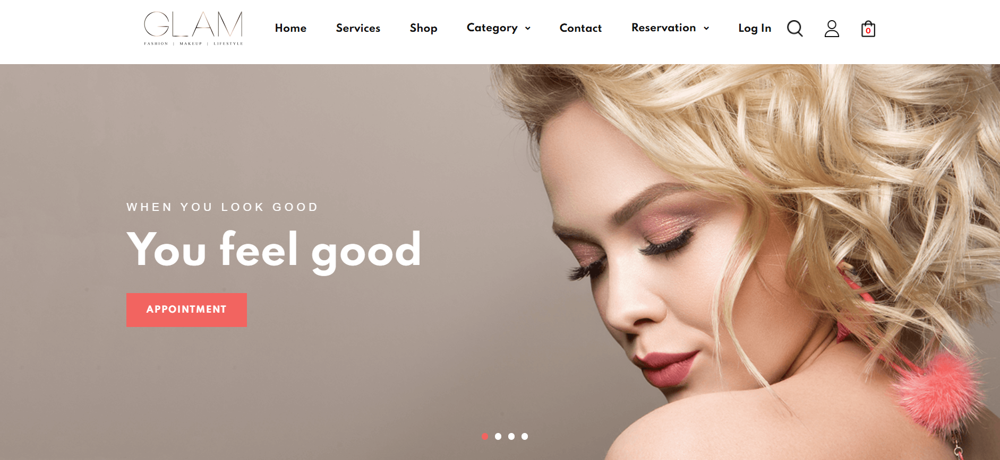
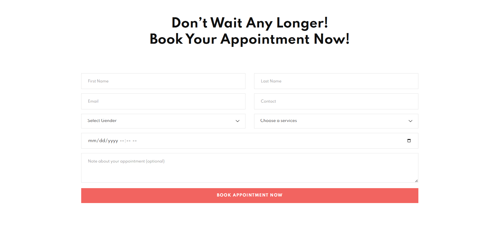
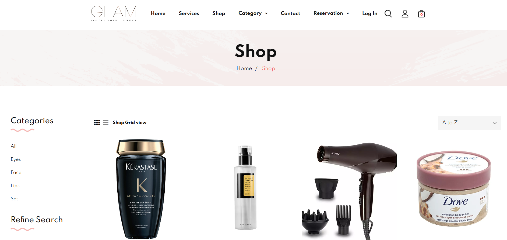

# Glam Salon Management System

A comprehensive web-based platform for managing salon appointments, services, products, and more. This project includes both a user-facing website and an admin panel for efficient salon management.

## 🚀 Features

### User Panel
- **Browse Services**: View available salon services and detailed descriptions.
- **Book Appointments**: Easily schedule appointments with preferred times and services.
- **Shop Products**: Browse and purchase beauty products directly from the website.
- **User Dashboard**: Manage profiles, view appointment history, and track orders.
- **Responsive Design**: Optimized for desktop and mobile devices.

### Admin Panel
- **Dashboard**: Overview of key metrics (appointments, customers, revenue, etc.).
- **Manage Appointments**: Approve, reject, or modify customer appointments.
- **Manage Services & Products**: Add, update, or remove services and products.
- **Manage Users**: View and manage customer accounts.
- **Reports**: Generate reports on sales, appointments, and performance.

## 🛠️ Technology Stack
- **Backend**: PHP
- **Database**: MySQL
- **Frontend**: HTML, CSS, JavaScript (SweetAlert2)
- **Frameworks/Libraries**: Bootstrap (likely), jQuery

## ⚙️ Setup Instructions

1. **Database Setup**:
   - Create a database named `projectdb` in your MySQL server.
   - Import the `projectdb.sql` file located in the root directory.

2. **Configuration**:
   - Ensure your local server (e.g., XAMPP, WAMP) is running.
   - Place the project folder in your server's root directory (e.g., `htdocs`).
   - Check `user_panel/connection.php` and `admin_panel/html/connection.php` to verify database credentials:
     ```php
     $connection = mysqli_connect("localhost", "root", "", "projectdb");
     ```

3. **Running the Application**:
   - **User Panel**: Access via `http://localhost/FY_Project/user_panel/`
   - **Admin Panel**: Access via `http://localhost/FY_Project/admin_panel/html/`

## 📸 Screenshots

### 1. Admin Side - Dashboard

*Comprehensive dashboard for managing all aspects of the salon.*

### 2. User Side - Home

*Landing page showcasing salon highlights and services.*

### 3. User Side - Appointment Page

*Integrated appointment booking system.*

### 4. User Side - Shop Page

*Online store for salon products.*

## 🤝 Contribution
Feel free to fork this repository and submit pull requests. For major changes, please open an issue first to discuss what you would like to change.

